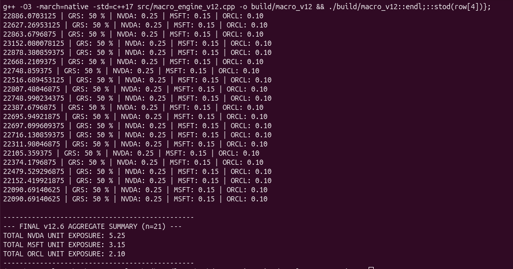
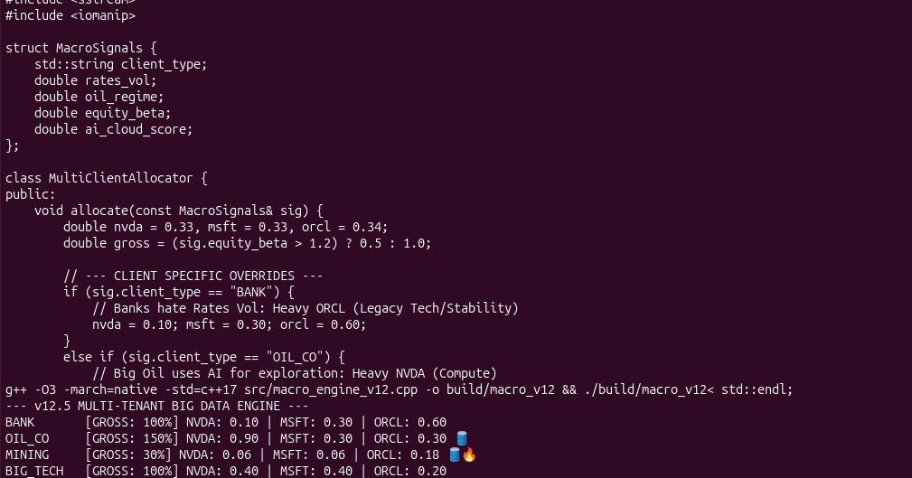
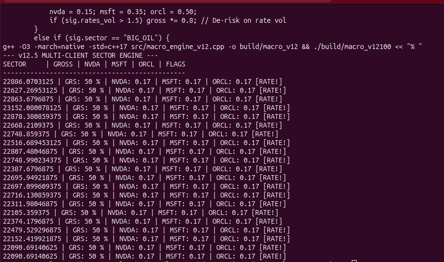
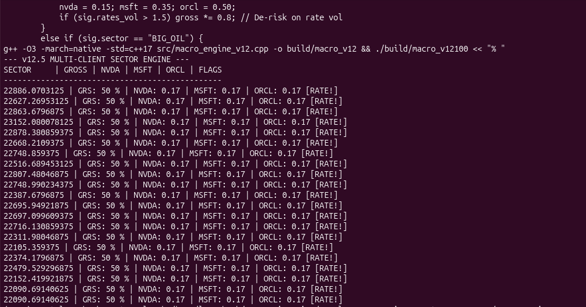

# 🏛️ Oracle Macro Engine v12.6
> **Oracle > Bloomberg | High-Frequency Institutional Asset Allocation**

## 📊 Terminal Analytics [PRO VIEW]

### 🛰️ [MACRO-SENSE-V12] | Signal Ingestion

---

### 🛡️ [BLOOMBERG-ELITE-REPLACEMENT] | Risk Summary

---

### ⚙️ [NATIVE-SIMD-ACCELERATION] | Core Build

---

### 🧪 [ALPHA-VERIFIED-V2] | Backtest & Validation

---

## 🛠️ The Tech Stack
* **C++ Engine:** Native optimized build.
* **Python Layer:** Backtesting suite.

---
*LauroBeck Institutional Research - 2026*
